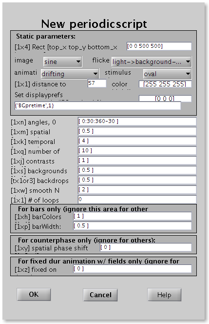

# Scripts

[Back to manual index](README.md)

Scripts are sequences of any combination of stimuli. [Leveltlab:] When a script is started, a high-to-low TTL pulse is given by the stimulus computer, over the serial port set in the NewStimConfiguration.m file. When an optogenetics trigger is set in the NewStimScriptEditor, a high-to-low TTL pulse is given at the start of each stimulus, right before the BGpretime starts.

## Periodicscript

Periodicscript is the workhorse for characterizing a neuron's response properties using drifting gratings.

Some parameters must be identical for all stimuli within the script:

- Rect - Location of stimulus, [top_x top_y bottom_x bottom_y] in pixels.
- Image - Image type can be one of the following:
- field (single luminance across field)
- square (field split into light and dark halves)
- sine (smoothly varying shades)
- triangle (linear light->dark->light transition)
- lightsaw (linear light->dark transition)
- darksaw (linear dark->light transition)
- bars of width (see below)
- edge (like lightsaw but with bars determining width of saw)
- bump (bars with internal smooth dark->light->dark transition)
- Animation - describes how the luminance profile will change. Can be either static, square wave, sine wave, ramp, drifting grating, fixed on-duration flicker for field stimulus.
- Flicker - either light > background -> light, dark -> background -> dark, counterphase
- Stimulus shape - can be either rectangle, oval, angled rect, angled oval or gaussian windowed (sigma_x=0.14 width, sigma_y=0.14*height)
- Distance - distance of the monitor from the viewing subject in cm.
- Color high - High intensity color, [r g b], each between 0 and 255.
- Color low - Low intensity color, [r g b], each between 0 and 255.
- Display prefs - Sets displayprefs fields, or use {} for default values, or for example {'BGpretime',1} for 1s of background color before the stimulus starts.

Other parameters can have a range of values. For each combination of these values a stimulus will be created.

- Angle - direction, in degrees, 0 is up, and then clockwise.
- Spatial frequency - in cycles per degrees
- Temporal frequency  - in Hz
- Number of cycles - the number of times the stimulus should be repeated. Stimulus duration will be the number of cycles / temporal frequency.
- Contrast - between 0-1: 0 is no difference from background, 1 is maximum difference.
- Background - luminance of the background, ranges between 0-1, from low to high color.
- Backdrop - describes the color of the area outside of display region. If [Nx1], then indicates luminance of background, 0-1 from low to high color. If [Nx3], then indicates actual RGB values to be used
- Smooth N - Blurs the image with a boxcar of this pixel width
- Loops - Number of forward and back loops, 0 is forward, 1 is forward and back, 2 is forward, back, and forward again, etc.

For bars only:

- barColors - For bar stimuli, the color of the bars (0-1 from low color to high color)
- barWidth - Width of bar (fraction of display rgn), only valid for bar stims
- For counterphase stimuli only:
- Phase shift - in radians (i.e. 2*pi is 1 cycle)
- For fixed duration stimuli only:
- Fixed on - fixed on-duration of squarewave flicker
