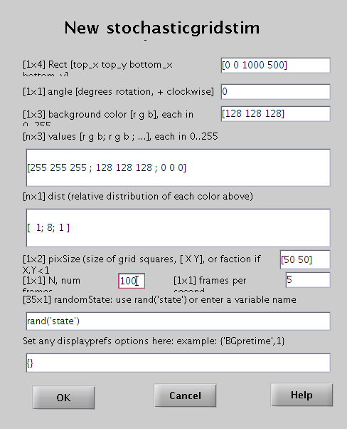

# Stimuli

[Back to manual index](README.md)

The stimulus class is the unitary presentation element of NewStim. Example stimuli are stochasticgridstim, periodicstim, quicktimestim, centersurroundstim. Stimuli can be defined by clicking on [New] in the StimEditor window, or from the Matlab prompt by calling their name, like

```matlab
ps = periodicstim('default')
```

or

```matlab
ps = periodicstim('graphical')
```

To retrieve the stimulus parameters, use:

```matlab
prms = getparameters( ps )
```

which can subsequently be edited, and used to create a new stimulus, e.g.

```matlab
prms.orientation = [0 45 90];
ps = periodicstim( prms );
```

Each stimulus has a parameter dispprefs, which is a cell list, and which can be used to specify a time to show a uniform background before the stimulus and a time to show the same after stimulus presentation, e.g.

```matlab
prms.dispprefs = {'BGpretime',2,'BGposttime',1};
```

## Stochasticgridstim

The stochasticgridstim is a versatile stimulus showing a checkerboard of randomly changing colors or luminances. A spike-triggered average of this stimulus can reveal the receptive field of a recorded neuron.



Stochasticgridstim takes the following parameters.

- Rect - Location of stimulus, [top_x top_y bottom_x bottom_y] in pixels.
- Angle - Rotation angle, in degrees (counterclockwise is positive).
- Background color - The color of the screen not covered by the grid. [r g b], each from 0 to 255. For example, gray would be [128 128 128].
- Values - Colors which may appear on the grid squares, [r g b;r g b;...], each from 0 to 255. For example, to have white, gray and black patches, choose [255 255 255;128 128 128; 0 0 0].
- Dist - Relative probability distribution of each color, i.e. prob(values(i,:)) = dist(i)/sum(dist). For example, if there are three colores, and the dist = [1;8;1], the first color covers on average one tenth of the patches.
- pixSize - Size of blocks x, y: [X Y] in pixels. If X and Y are less than one, then it uses that fraction of the total width and height, respectively. Note that the blocks must exactly fill up the stimulus rect.
- N - Number of frames to make.
- Frames per second - Speed at which to show the frames, in frames per second. The stimulus duration (apart from BGpretime and BGposttime) can be calculated by dividing the number of frames N by the frames per second rate. The optimal rate will depend on the animal, for a mouse 5 fps seems a good rate.
- randState - The random state to use as the seed for generating the random numbers, for example rand('state').  See 'help rand'.
- Displayprefs    - Sets displayprefs fields, or use {} for default values, or for example {'BGpretime',1} for 1s of background color before the stimulus starts.

Type 'help stochasticgridstim' at the Matlab prompt for more information.

To create a stochasticgridstim script, either create a stimulus first and make a script with the stimulus, or take the shortcut by clicking [SG] in the Tools panel of the RunExperiment window.

## Periodicstim

Periodicstim is a versatile stimulus for showing spatially periodic stimuli, like sinusoidal or square wave gratings. Most fieldnames speak for themselves. For orientation (better named direction), it is good to know that 0 degrees means a horizontal bar moving up and 90 degrees is a bar moving to the right.

Two important available features that did not yet make it into the gui, are the possibility to add two stimuli, for instance to make compound motion stimuli, and the possibility to mask a stimulus with another.

How to do this?

First create the two periodicstimuli, say ps1 and ps2. Next type at the matlab prompt:

```matlab
par = getparameters(ps1);
par.ps_add = ps2;   % or par.ps_mask = ps2
ps1and2 = periodicstim( par );
```

Next, you can update the StimEditor and create a script based on this stimulus.
