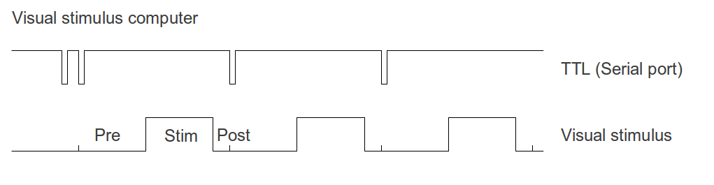

# Timing and synchronization

[Back to manual index](README.md)

For analysis, it is often crucial to match the time of the stimulus with the time of the acquired signal, beit spikes, LFP or behavioral data. This is generally accomplished by triggers sent out by the stimulus computer, just before the start of a trial or before every stimulus, but other solutions, such as triggering of the stimulus itself are also possible and implemented in NewStim. We first describe the most common setup here, which is the stimulus computer emitting a trigger and saving the times of the stimuli and the time of the trigger on the clock of the stimulus computer. Depending on NewStimConfiguration on the stimulus computer it is possible that also a trigger is send (on the same or different pin) at the start of each stimulus.



The diagram shows the timing of script and stimulus TTL triggers relative to the visual stimulus, including the pre- and post-stimulus background periods.

Commonly, stimuli are displayed in NewStim via the function DisplayStimScript( stimScript). If NSUseInitialSerialTrigger is true (set in the local NewStimConfiguration), this function will call

```matlab
OpenStimSerial
```

to open the serial ports specified in NewStimConfiguration, and then flips up pin down and up.

```matlab
StimSerial(StimSerialScriptOutPin,StimSerialScript,0);
WaitSecs(0.001);
StimSerial(StimSerialScriptOutPin,StimSerialScript,1);
```

Note that nowhere in the code currently this pin is initiated to 1, but when the warmup script is ran in initstims, the pin is left up.

When a stimulus is run by Runexperiment and the Acquire check box is checked. A file

stims.mat is written in the folder indicated by Path and Trial in the Runexperiment window.

Note that the NewStim code also contains functions for a more complex and adaptable sequence of Triggers, via the StimTriggerAct function. Currently this code is not in use and would need to be checked before it can be applied.

## stims.mat file

The stims.mat file that is saved after the stimulus is presented contains

- MTI2: {n_stimuli} struct with stimulus display information, among this
- preBGframes: 240 % number of frames for preBG time
- postBGframes: 0  % number of frames for preBG time
- frameTimes: [1x120 double] % not including pre and postBG times
- startStopTimes: [1.3645e+09 1.3645e+09 1.3645e+09 1.3645e+09] %
- stimid: 6 % the identity of the stimulus shown at this point in the script sequence
- start: time of starting trigger in s in stimulus computer clock time
- NewStimPixelsPerCm: pixels per centimeter on stimulus display
- saveScript: copy of the presented script
- StimWindowRefresh: refresh rate on stimulus display
- NewStimViewingDistance: distance of display to subject

The startStopTimes vector is [start of BGpretime,  start of stimulus, start of BGposstime (=end of stimulus), end of BGposttime], all in second in stimulus clock times.

When using InVivoTools, you can load the stims.mat file for a specific record record from a test database by

```matlab
getstimsfile( record )
```

To retrieve the parameters of the script saveScript:

```matlab
getparameters( saveScript )
```

To obtain a cell list of the individual stimuli:

```matlab
stims = get( saveScript )
```

the parameters of these stimuli can be queried like:

```matlab
getparameters( stims{1} )
```

To obtain the sequence in which the individual stimuli that made up the script were run:

```matlab
getDisplayOrder( saveScript)
```

To see how to obtain other information from scripts or stimuli, try

```matlab
methods( saveScript )
```

or

```matlab
methods( stims{1} )
```

## Synchronization with electrophysiology data

Any electrophysiology data that is saved in conjunction with the presentation of NewStim stimuli can be triggered by stimulus computer or can record the trigger on a separate channel along with the electrophysiology signal. The timestamps of the acquired computer, however, are following the clock of the acquisition computer and not the stimulus computer. This will result in a shift of the time and a multiplication (very close to 1), because normally the clocks on the stimulus and acquisition computer will not run exactly in sync. Currently, when ephys data is read in the timestamps of the physiology data is realigned to the starttime of the stimulus (as saved in stims.mat) and adjusted by

```matlab
acquisition.time = acquisition.time *secondsmultiplier + trial_ttl_delay;
```

The parameters secondsmultiplier and timeshift are set in ecprocessparams.m.
