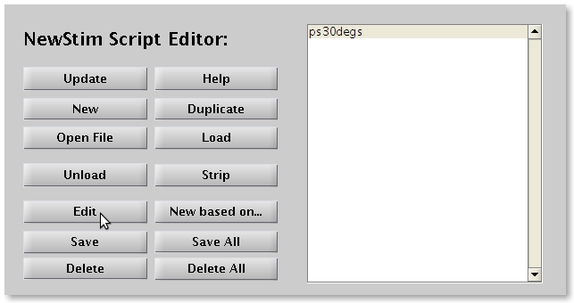
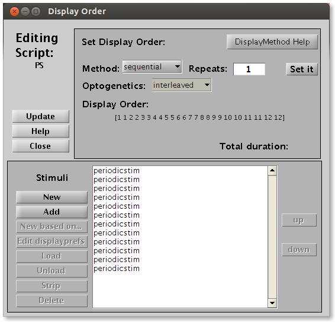
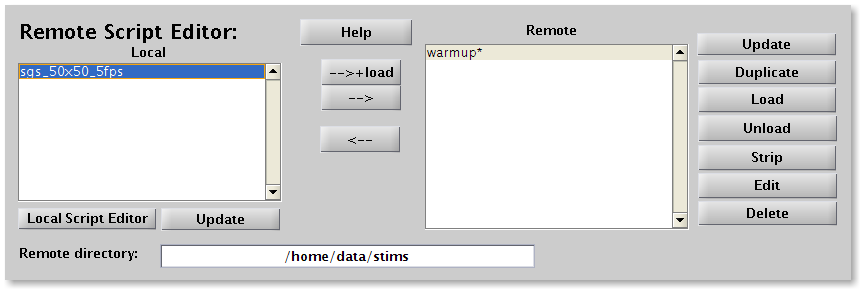

# Short tutorial

[Back to manual index](README.md)

## Starting NewStim on the remote stimulus machine

Start matlab and type

```matlab
initstims
```

This will start a short drifting grating stimulus and will set the stimulus computer to slave mode, obeying the commands of the local host.

## Starting NewStim control on the local host

Start Matlab and start RunExperiment from the matlab prompt:

```matlab
runexperiment
```

or [Levelt lab specific] indirectly by selecting one of the experimental database like tptestdb or

ectestdb and clicking on [Stimulus].

If initstims executed properly on the remote machine, and the local and remote computers

communicate, the white Stimulus panel on the center right will show the 'warmup' stimulus. The

star behind 'warmup' indicates that the stimulus is loaded and ready to be presented.


## Creating a stimulus script

To make a series of drifting gratings, click on [ScriptEditor]. This opens the ScriptEditor window. Click on [New], select [periodicscript] and choose a name, e.g. 'ps30degs'. In the figure that pops up, you can set all stimulus parameters. Most parameters are unique to each type of stimulus, but two are important for most scripts and stimuli:

Rect which is a 1x4 vector giving the location of the stimulus as [top_x top_y bottom_x bottom_y]. If you have a 1240x1024 monitor and would like to present a full screen stimulus, set Rect to [0 0 1240 1024]. If you want to show a 400x400 pixel block centered at the middle use [1240/2-200 1024/2-200 1240/2+200 1024/2+200].

Displayprefs is a cell list containing some generic display parameters. For instance {'BGpretime',1, 'BGposttime',2} specificies a 1s presentation of fullscreen of background color before and a 2s background after each stimulus.

For periodicscript specifically, one can, for example, change the stimulus angles to a range of 8 directions, 0:45:315, which is Matlab speak for the series 0,45,90,...,315. For more specific information on all stimulus parameters, refer to the Stimuli and Scripts sections.

After clicking [OK], the script has been added to the local script list, shown in the Script Editor.



## Changing presentation order and number of repetitions

Bring up the ScriptEditor, if it is not already open, by clicking [ScriptEditor] in the RunExperiment window. Select the script of interest, e.g. ps30degs from the example above. Click [Edit]. This will bring up the Editing Script window, showing a list of the individual stimuli which make up the selected script (in the case of the example, 12 gratings of different directions).



To present the stimulus multiple times, type in the number behind Repeats. Optionally change the display order method, which can be

- sequential, showing them in order, i.e. 0, 30, 60 deg, etc, for our example.
- random, showing for each repetition the stimuli in a random permutation.
- specified, will let you select the exact presentation order
- When Optogenetics is set to interleaved, each stimulus is shown twice, once without a TTL trigger and once with TTL trigger [Leveltlab only]. Other options are none, and all.

Click [Set it], and the display order will be shown between square brackets. If you are happy with the result, click [Close] to close the figure.

## Transfering and loading a script

When a script is created on the local host, the remote stimulus computer will not directly know about it. The script's parameters will need to be transferred to the remote stimulus computer. Click on [RemoteScriptEditor] in the RunExperiment window. The left panel shows all scripts on the local host. The right panel shows all scripts on the remote host. Scripts loaded into memory are followed by a star. To transfer the script and set it up for presentation, click on [-->+load]. A 'please wait' pop-up message will appear. This can take several seconds or up to a minute depending on the complexity of the stimulus. When the wait message disappears, your script is ready to be shown.



## Presenting a stimulus

After the stimulus has been loaded on the remote stimulus computer, it can be shown by simply clicking [Show script] in the RunExperiment window. If the Acquire checkbox is left unchecked, no record will be kept of the stimulus presentation. If it is checked, a new folder will be created in the Path given at the top line of the RunExperiment window. This subfolder will be named the next available folder of the type t00001, and will be shown behind Trial. After the presentation is finished a file called stims.mat containing all stimulus parameters, order and presentation times will be written in this folder (see separate section on stims.mat). It is best practice to store any simultaneously acquired physiological data in the same folder.

## Interrupting a stimulus presentation

On the remote stimulus computer, simultaneously press the Ctrl and 'c' keys several times. The stimulus window will still cover the screen and hide the Matlab prompt. To close the stimulus window, type

```matlab
clear screen
```

followed by Enter. This should close the stimulus screen and return you to the Matlab prompt. If this fails, repeat this procedure, possibly after pressing [Alt-Tab] several times to select the Matlab window. After returning to a visible matlab prompt, either you can quit matlab by typing 'quit' or restart stimulus slave mode by typing 'initstims'.

## Creating a script from a stimulus

Not all stimuli come with a prepackaged script interface like the periodicscript gui that we have seen in the above example. In this case, or if you want to make a collection of stimuli ranging over a parameter which is not allowed for by the script gui, you should first create the stimuli using the StimEditor.

Suppose we want to make a script consisting of a small and a large drifting grating stimulus. First open the StimEditor by clicking on [StimEditor] in the RunExperiment window. Click on [New], select 'periodicstim' and name the stimulus 'pssmall'. Choose [320-50 240-50 320+50 240+50] as the Rect and click [OK].

Next create a second, larger stimulus, by reclicking [New] in the StimEditor window, selecting 'periodicstim'  again, and this time naming it 'pslarge'. Choose [320-100 240-100 320+100 240+100] as Rect and click [OK].

You will see the two stimuli listed in StimEditor's stimuli panel. Select them both (by using Shift or Ctrl keys while clicking) and click on [New Script with ...] and choose a name for your script. The stimulus numbers will be correspond to their order of in the stimulus list in the StimEditor panel, not to their creation number.

## Saving and loading a script or a stimulus

Stimuli and scripts can be saved for later use by using the [Save] button in the StimEditor and ScriptEditor windows, respectively. Not surprisingly, with the [Load] button you can load previously saved stimuli and scripts.

## Testing a stimulus script locally

When you have created a stimulus script with the ScriptEditor or by invoking e.g. periodicscript('graphical') or periodicscript('default') from the Matlab prompt, you may sometimes would like to test the script locally. Before you can do this, make sure to you have once ran NewStimInit. This creates a matlab file called NewStimConfiguration, if it did not already exist. After it is created, edit the file by typing:

```matlab
edit NewStimConfiguration
```

and edit the two lines containing StimComputer and StimDebug parameters to read:

```matlab
StimComputer = 1;       % is this a stimulus computer?
StimDebug = 1;
```

This you will only have to do once. The StimDebug = 1 option will make the stimulus appear in a 640x480 window. This avoids the stimulus window to fill your entire desktop, so that you can continue to see the matlab command window.

If your script (created by the ScriptEditor) is called 'testscript', you can do this by typing

```matlab
NSLoadAndRunTest(testscript)
```

If you would like to test the default stimulus of a certain stimulus class, e.g. periodicstim, you need to type

```matlab
NSLoadAndRunTest('periodicstim')
```

## Making a movie from a stimulus script

When you would like to show you stimulus in a presentation, it is easier to have a prepared movie, than to run NewStim. You can make a quicktime movie from a script, from example named 'testscript' by typing

```matlab
NSCaptureMovie( testscript)
```

The movie will be called 'stimulus_movie.mov' and will be saved on the desktop. Timing of the script should be fairly accurate, but is not guaranteed to be exact. Be prepared that the creation will take some time.
