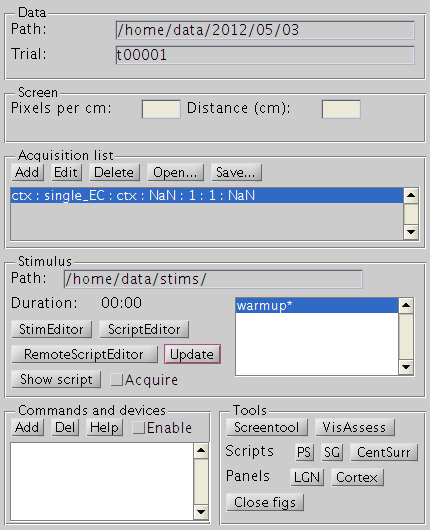

# Window glossary

[Back to manual index](README.md)

## Runexperiment

Data panel shows where stimulus data is saved

Path points to where the data of the presented stimuli will saved be in subfolder and will depend on the particular stimulus setup you are using. [Leveltlab: Often RunExperiment is invoked not by the command line, but by the Stimulus button in the experimental database. This will set the path to the right location for the specific experiment.] Path can be edited by the user.

Trial is the subfolder in the Path folder where information on the last presented stimulus and recorded is stored. Trial will start from t00001, but will be automatically updated whenever stimulus presentation is started and Acquire is checked to the first not-existing folder of the form 't%05d', where %05d is a 5 digit number with leading zeros.

Screen panel contains information of the stimulus display.

Pixels per cm can be calculated by dividing the horizontal screen resolution by the width of the screen. Check if dividing the vertical screen resolution by the height of the screen gives the same value. If not, change the aspect ratio on the monitor or by the operating system settings. The aspect ratio is always assumed to be square for stimulus generation.

Distance is the distance of the screen to the subject's eyes in cm.

Acquisition list contains information about the data acquisition that is done simultaneously with the stimulus presentation. [Leveltlab: This is no longer used for anything, but still required and filled in automatically by starting RunExperiment.]

Stimulus panel provides stimulus information and control

Path is read-only and shows in which local folder the communication with the remote computer takes place.

Duration is the duration of the last presented stimulus and is updated when a stimulus is shown.

The righthand panel shows all stimulus scripts which are presented on the remote computer. An asterisk behind a script shows that a stimulus is loaded, and ready to be shown.

StimEditor opens a window to create and edit stimuli

ScriptEditor opens a window to create and edit stimulus scripts

RemoteScriptEditor opens a window to sync stimulus script between the local and remote computers.

Update will update the remote script list.

Show script will prompt the remote computer to start showing the selected script.

Acquire will toggle whether a new Trial folder is created and a stims.mat file with stimulus information is stored after presentation of the stimulus.
